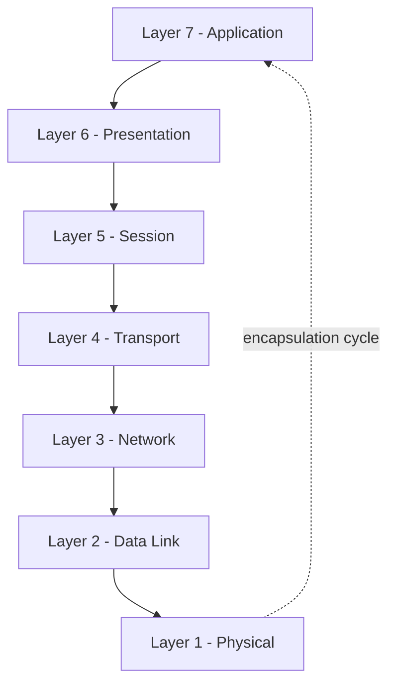

# DevOps Learning — Networking

A personal knowledge base of notes, labs, and practice scripts documenting my journey through networking fundamentals — built specifically through a DevOps and Cloud lens.

This repo grows from core concepts up to the networking patterns you actually run into when deploying, securing, and debugging cloud infrastructure.

---

## 📖 Table of Contents

- [Topics Covered](#-topics-covered)
- [The OSI Model — A Practical View](#-the-osi-model--a-practical-view-for-devops)
- [Layer-by-Layer Breakdown](#-layer-by-layer-breakdown)
- [Common Tools by Layer](#-common-tools-by-layer)
- [Why This Matters for DevOps](#-why-networking-matters-for-devops)

---

## Topics Covered

| Category | Topics |
|---|---|
| **Foundations** | OSI Model, TCP/IP Model |
| **Addressing** | IP Addressing & Subnetting, DNS & Records |
| **Traffic Flow** | Routing & Switching Basics |
| **Security** | Firewalls & Security Rules |
| **Cloud** | Cloud Networking Concepts |
| **Diagnostics** | `ping`, `traceroute`, `nslookup`, `dig` |

---

## The OSI Model 

The OSI model often gets dismissed as "textbook theory," but in practice it's one of the most useful mental models for **diagnosing outages, designing resilient systems, and reasoning about where data is actually breaking down**.

Every request your users make — a page load, an API call, a database query — travels down through these layers on one end and back up on the other. When something breaks, knowing *which* layer to look at saves hours of guessing.

> **Troubleshooting tip:** Work from the bottom up. A dead cable or downed VM (Layer 1) will masquerade as a broken app (Layer 7) if you don't rule out the lower layers first.

---

##  Layer-by-Layer Breakdown

### Layer 1 — Physical
The main hardware layer: cables, switches, routers, NICs, and — in cloud environments — the underlying VM or bare-metal host. If power is out or a link is down, everything above it fails too. Always the first thing to rule out.

### Layer 2 — Data Link
Governs communication between devices sharing the same local network segment. This is where MAC addresses, Ethernet framing, and switch behaviour (VLANs, ARP tables) live.

### Layer 3 — Network
Handles moving packets *between* different networks. IP addressing, subnetting, routing tables, and network-level firewalls all operate here — this is the layer most cloud VPC/subnet design decisions map to.

### Layer 4 — Transport
Decides *how* data gets delivered: reliably and ordered via **TCP**, or fast and best-effort via **UDP**. Ports, sessions, and connection integrity are managed here — critical for understanding load balancers and connection timeouts.

### Layer 5 — Session
Manages the life cycle of a connection: opening it, keeping it alive, and closing it cleanly. Less visible day-to-day, but relevant when debugging dropped or hanging connections.

### Layer 6 — Presentation
Translates data into a form applications can use. This includes TLS/SSL encryption, character encoding, and compression — the layer most often responsible for "certificate" and "handshake" errors.

### Layer 7 — Application
The layer end users and developers interact with directly: web apps, REST/GraphQL APIs, email, DNS lookups from an app's perspective. Most bug reports ("the app isn't working") start here, even when the real cause is buried several layers down.

---

## 🛠 Common Tools by Layer

| Layer | Example Tools | What They Help You Check |
|---|---|---|
| Application (7) | `curl`, `dig`, browser devtools | Is the service responding correctly? |
| Presentation (6) | `openssl s_client` | Is TLS negotiating properly? |
| Transport (4) | `netstat`, `ss`, `nc` | Is the port open and listening? |
| Network (3) | `ping`, `traceroute`, `ip route` | Is the packet reaching its destination? |
| Data Link (2) | `arp -a` | Is MAC/ARP resolution working locally? |
| Physical (1) | `ethtool`, cloud console link status | Is the interface/link actually up? |

---

## Why Networking Matters in DevOps

Networking is the connective tissue underneath every deployment, cloud migration, and system integration. A solid grasp of it means:

- **Faster troubleshooting** — knowing which layer to check first instead of guessing
- **More reliable deployments** — understanding how traffic actually flows between services
- **Stronger security posture** — designing firewall and routing rules with intent, not by trial and error
- **Better cloud architecture** — VPCs, subnets, and load balancers all map directly back to these fundamentals

---

*This repo is a living decontamination — updated as i work through different concepts.*

